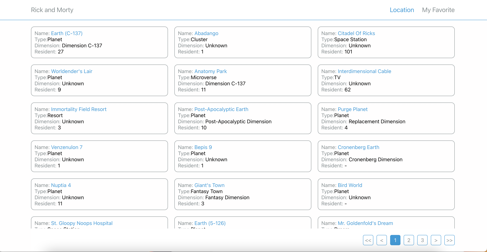
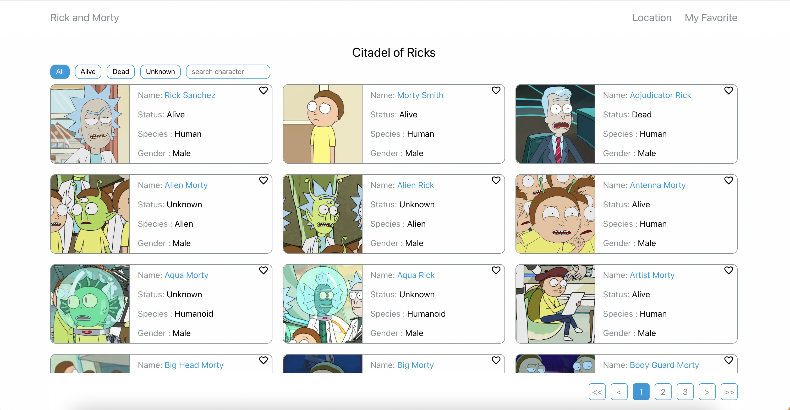
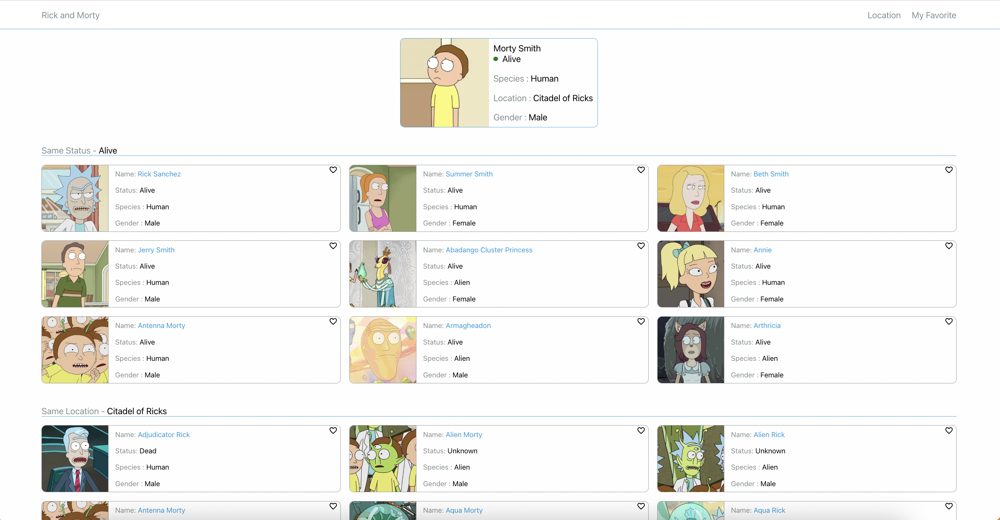
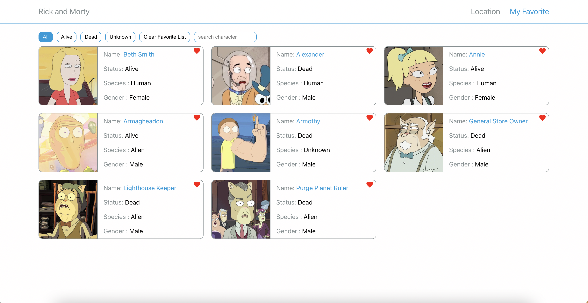
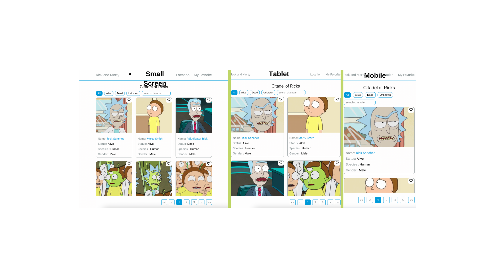

# Rick & Morty

[Demo](https://rick-morty.pages.dev/)

---

### Location Page

## Location Detail Page

## Character Detail Page

## Favorite Page

## responsive

## Installation Instructions

1.  Clone or download the project:

        git clone https://github.com/muzaffercankaplan/Fitness-App.git

2.  Go to the project directory and install the requirements:

        cd fitness-app
        npm i

3.  Start the application:

        npm start
